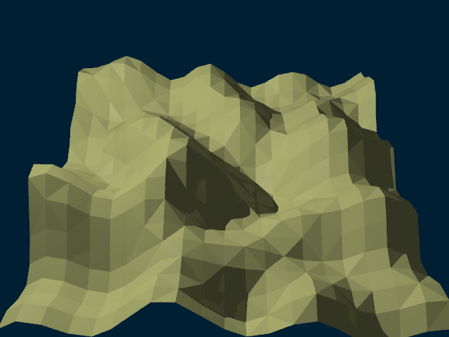
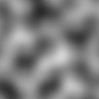
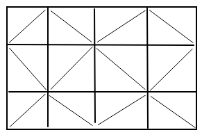
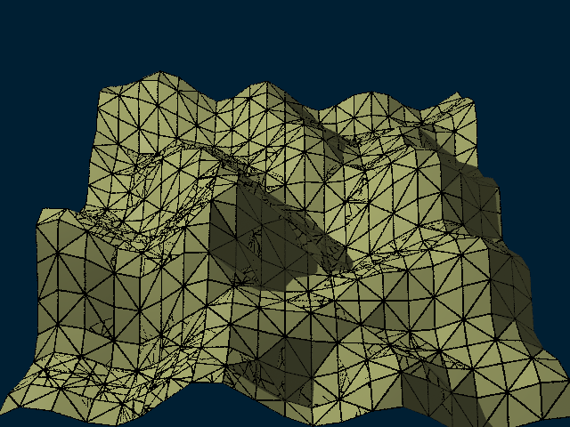
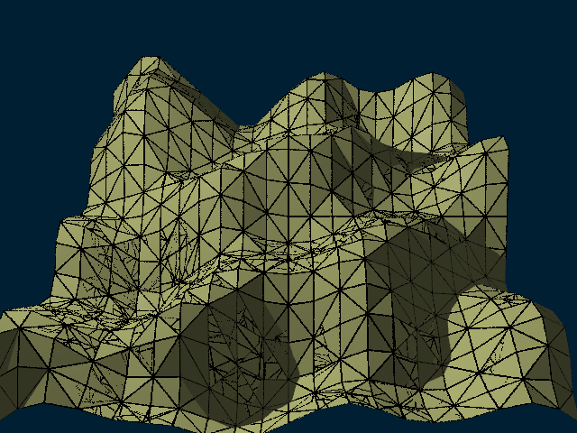

# Extension: Terrain



### Author: Martin Vasina

### Category: Solid

### Namespace: MartinVasina

### Class name: Terrain : DefaultSceneNode, ISolid

### ITimeDependent: No

### Source file: Terrain.cs

Toto rozsireni implementuje teren jako nove teleso (ISolid).
Teren je generovan pomoci sumove funkce.



Teren je vygenerovan jako mrizka vrcholu (Vector3d), ktera je nasledne prevedena na sit trojuhelniku.



Uzivatel muze definovat rozmery terenu:
xMi	- nejmensi x-ova souradnice
xMa	- nejvetsi x-ova souradnice
yMi	- nejmensi y-ova souradnice
yMa	- nejvetsi y-ova souradnice
zMi	- nejmensi z-ova souradnice
zMa	- nejvetsi z-ova souradnice

Dale lze definovat:
unitSize	- jednotkova velikost mrizky
random		- zda ma byt teren vygenerovan nahodne
border		- zda se maji zobrazit hrany trojuhelnikove site
k		- parametr pouzivany jako podil pro souradnice v sumove funkci, umoznuje nastavit clenitost terenu

Metodou GetTerrainHeight(double x, double y) lze zjistit vysku terenu na souradnicich (x,y)

## Example

From a scene/animation definition script
```
using MartinVasina;

...

Terrain terrain = new Terrain(-10,10,-10,10,0,10,1,false,true,5);
double height = terrain.GetTerrainHeight(-3, -2);
terrain.SetAttribute(PropertyName.COLOR, new double[] {0.37, 0.39, 0.145});
root.InsertChild(terrain, Matrix4d.Identity);
```

Zde hodnoty `-10`, `10`, `-10`, `10`, `0`, `10` znaci rozmer terenu, `1` je jednotkova velikost mrizky, `false` teren nema byt nahodny (nebude provedena permutace),
`true` budou zobrazeny hrany trojuhelnikove site, `5` parametr k reguluje clenitost terenu.

### Sample scene script: TerrainScene.cs

## Images

Random: false, Border: false


Random: false, Border: true



Random: true, Border: true



